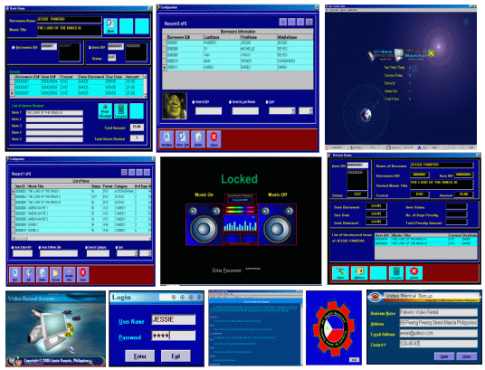



## A Unique Video Rental System

### Description

A user-friendly application. I hope it can somewhat help others who are starting to learn ADO Programming. Its almost 1MB in (zip) size but its worth downloading.
 
### More Info
 

             |
---                |---
**Submitted On**   |2005-06-06 12:14:54
**By**             |[Jessie Panerio](https://github.com/Planet-Source-Code/PSCIndex/blob/master/ByAuthor/jessie-panerio.md)
**Level**          |Beginner
**User Rating**    |4.7 (121 globes from 26 users)
**Compatibility**  |VB 3\.0, VB 4\.0 \(16\-bit\), VB 4\.0 \(32\-bit\), VB 5\.0, VB 6\.0, VBA MS Access
**Category**       |[Complete Applications](https://github.com/Planet-Source-Code/PSCIndex/blob/master/ByCategory/complete-applications__1-27.md)
**World**          |[Visual Basic](https://github.com/Planet-Source-Code/PSCIndex/blob/master/ByWorld/visual-basic.md)
**Archive File**   |[A\_Unique\_V189757652005\.zip](https://github.com/Planet-Source-Code/jessie-panerio-a-unique-video-rental-system__1-60940/archive/master.zip)

